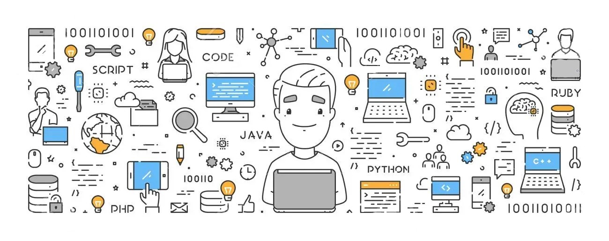

<!-- ----------- HEAD SECTION ------------ -->

  

 
## I'm a Student, and Developer !! 
**About me**
- ❤️ I love Coding ❤️
- 🧑‍🎓 Pursuing Bachelor of Technology in Computer Science 
- 🌱 I’m currently learning everything 🤣
- 👯 I’m looking to collaborate with other on projects
- 🥅 2022 Goals: Learn about AI-ML
- 📚 Know more about me : [here](https://soumyadip201.github.io/Soumyadip-Majumder-Portfolio/)
- 💬 Ask me about anything : [here](https://github.com/soumyadip201/soumyadip201/issues)
 
<!-- ----------- HEAD SECTION END ------------ -->

<!-- ----------- TECH STACK SECTION ------------ -->

 
 
 
 
 
 
 
 
 

 
 
 
 
 
 
 

<!-- ----------- TECH STACK SECTION END------------ -->

&nbsp;

&nbsp; 

 
 

<!-- ----------- GITHUB STATS SECTION END ------------ -->

<!-- ----------- CONNECT WITH ME SECTION ------------ -->

 
 

 
 

<!-- ----------- CONNECT WITH ME SECTION END ------------ -->

[twitter]: https://twitter.com/soumyadipASM
[instagram]: https://www.instagram.com/soumyadip._asm/
[linkedin]: https://www.linkedin.com/in/soumyadip-majumder-364a6a172/
[github]:https://github.com/soumyadip201
[gmail]:mailto:soumyadip201@gmail.com

 
 

